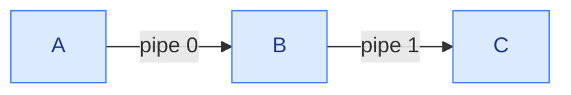
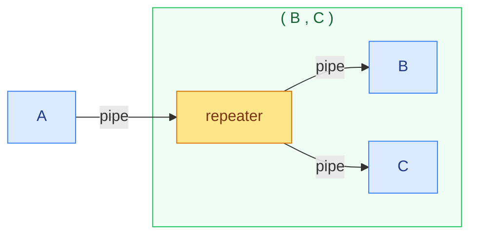

# ESHELL 🐚

 

## 📖 Overview

This project simulates a Linux shell, incorporating nearly all standard functionalities and additional extensions.

```
/> ls -l | tr /a-z/ /A-Z/ ; echo done
/> cat input.txt | grep log , ls -al /dev
/> (ls -l ; echo done) | (wc -l , wc -c)
```

`|` is a pipe, `;` runs commands one after another and `,` runs them in parallel. Subshells are written in parentheses. `quit` exits the shell.

## ✨ Features

- Executes Linux commands
- Supports piping.
- Supports parallel execution.
- Supports sequential execution.
- Supports subshells
- No memory leaks, no zombie processes.

## ⚙️ Implementation

### Pipelines

A single command is just a pipeline with one stage. A subshell is also a stage. So one function runs all of them.

For `A | B | C` the shell creates 2 pipes and forks every stage. Only then it waits for them.



Waiting for `A` before starting `B` would not work. `A` blocks when the pipe is full (64 KB) and nobody is reading it.

### Subshells

A subshell stage is a forked child. It parses the string inside the parentheses and runs it like a normal line. Then it exits.

### Repeater

In `A | (B , C)` both `B` and `C` should get the whole output of `A`. If they read the same stdin they would split it. So the subshell forks a repeater. It reads stdin and writes every chunk to one pipe per branch.



If a branch exits early (like `head`), the repeater stops writing to it and keeps feeding the others. The repeater is only created when something is piped into the subshell.

## 📊 Code Count

I'm not counting parser.h and parser.c here because I didn't write them.

| Language  | Files | Lines   | Code    | Comments | Blanks |
| --------- | ----- | ------- | ------- | -------- | ------ |
| C Header  | 2     | 40      | 33      | 0        | 7      |
| C++       | 3     | 234     | 202     | 15       | 17     |
| Makefile  | 1     | 3       | 3       | 0        | 0      |
| **Total** | **6** | **277** | **238** | **15**   | **24** |
